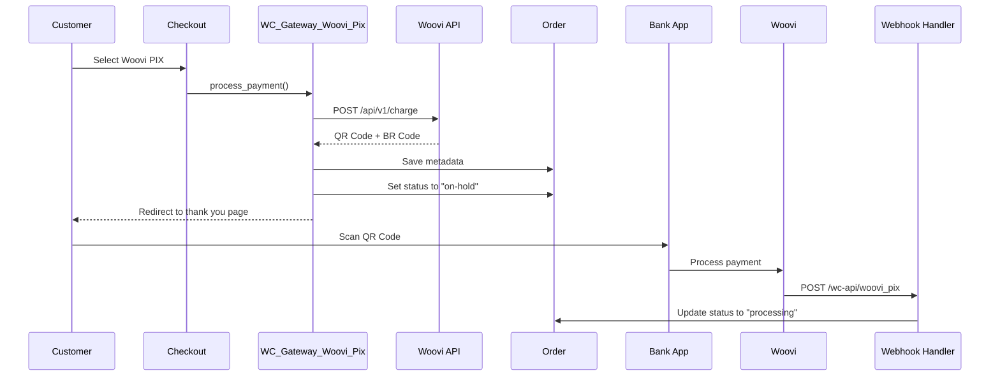
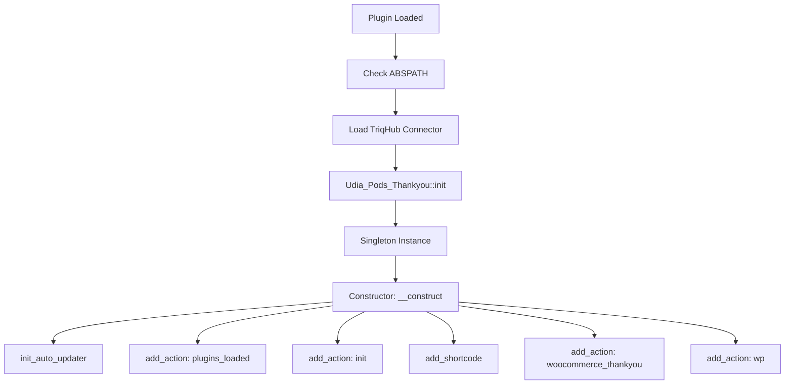
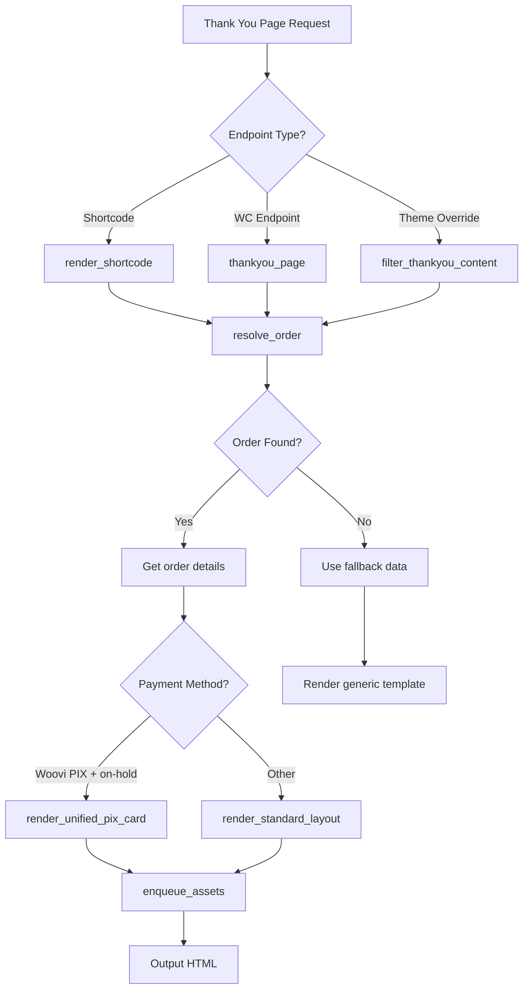
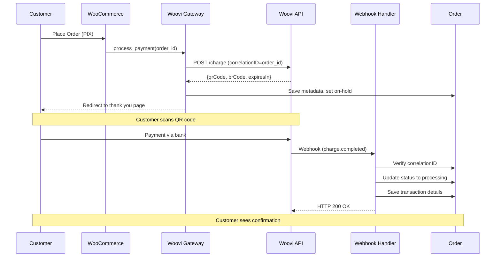

# TriqHub: Thank You Page - Architecture Documentation

## 1. Overview

**TriqHub: Thank You Page** is a proprietary WordPress plugin developed for Udia Pods that replaces standard WooCommerce thank you pages with branded, conversion-optimized post-purchase experiences. The plugin integrates PIX payments via Woovi API, provides tutorial content delivery, and maintains visual identity consistency across the customer journey.

## 2. Directory Structure

```
triqhub-thank-you/
├── triqhub-thank-you.php              # Main plugin file (bootstrap)
├── includes/
│   ├── core/
│   │   └── class-triqhub-connector.php # TriqHub invisible connector
│   ├── class-wc-gateway-woovi-pix.php  # WooCommerce payment gateway
│   └── class-woovi-webhook-handler.php # Webhook processor
├── assets/
│   ├── css/
│   │   ├── thankyou.css               # Frontend styles
│   │   └── triqhub-admin.css          # Admin styles
│   └── js/
│       └── thankyou.js                # Frontend interactivity
├── vendor/                            # Composer dependencies
│   └── yahnis-elsts/plugin-update-checker/
├── diagnostic.php                     # Gateway diagnostic utility
├── test-woovi-api.php                 # Emergency API debug script
└── quick-test.php                     # Quick integration test
```

## 3. Core Components

### 3.1 Main Plugin Class: `Udia_Pods_Thankyou`

**Singleton Pattern Implementation:**
```php
final class Udia_Pods_Thankyou {
    const VERSION   = '1.0.0';
    const HANDLE    = 'udia-pods-thankyou';
    const SHORTCODE = 'udia_pods_thankyou';
    
    public static function init(): void {
        static $instance = null;
        if ( null === $instance ) {
            $instance = new self();
        }
    }
}
```

**Key Responsibilities:**
- Plugin initialization and lifecycle management
- Asset registration and enqueueing
- Shortcode registration and rendering
- Template rendering orchestration
- Payment gateway integration

### 3.2 Payment Gateway: `WC_Gateway_Woovi_Pix`

**Class Hierarchy:**
```
WC_Payment_Gateway
    └── WC_Gateway_Woovi_Pix
```

**Configuration Fields:**
```php
$this->form_fields = array(
    'enabled'      => array('title' => 'Ativar/Desativar', 'type' => 'checkbox'),
    'title'        => array('title' => 'Título', 'type' => 'text'),
    'description'  => array('title' => 'Descrição', 'type' => 'textarea'),
    'testmode'     => array('title' => 'Modo de Teste', 'type' => 'checkbox'),
    'app_id'       => array('title' => 'AppID (Produção)', 'type' => 'password'),
    'test_app_id'  => array('title' => 'AppID (Teste)', 'type' => 'password'),
    'expires_in'   => array('title' => 'Expiração (segundos)', 'type' => 'number'),
    'webhook_url'  => array('title' => 'Webhook URL', 'type' => 'title')
);
```

**Payment Flow:**


### 3.3 Webhook Handler: `Woovi_Webhook_Handler`

**Event Processing Matrix:**

| Event Type | Status | Action | Order Status Change |
|------------|--------|--------|---------------------|
| charge.completed | COMPLETED | Complete payment | on-hold → processing |
| charge.active | ACTIVE | Log activity | No change |
| charge.expired | EXPIRED | Cancel order | on-hold → cancelled |
| pix.received | COMPLETED | Complete payment | on-hold → processing |

**Webhook Security:**
- No signature verification (Woovi doesn't provide webhook signatures)
- Relies on correlationID matching order ID
- Validates payment method before processing
- Prevents duplicate processing via transaction ID check

### 3.4 Template Rendering System

**Template Selection Logic:**
```php
private function render_template( $order, array $atts = [] ): string {
    $is_woovi_pix_pending = $order && 'woovi_pix' === $order->get_payment_method() 
        && $order->has_status( 'on-hold' );
    
    if ( $is_woovi_pix_pending ) {
        $this->render_unified_pix_card( $order ); // PIX payment pending
    } else {
        $this->render_order_summary( $order );    // Standard thank you
        $this->render_knowledge_card( $atts );
    }
    
    $this->render_tutorial( $atts );
    $this->render_support_block( $atts );
}
```

**Component Hierarchy:**
```
<section class="utp-wrapper">
├── <header class="utp-hero"> (Order confirmation)
├── Conditional: PIX pending? → Unified PIX Card
│   ├── Order Details Column
│   └── Payment Details Column
├── Else → Standard Layout
│   ├── Order Summary Card
│   └── Knowledge Card
├── Tutorial Timeline (Conditional)
└── Support Block (Conditional)
```

## 4. Database Schema

### 4.1 WooCommerce Order Meta

**Woovi-Specific Metadata:**
```sql
-- PIX Charge Information
_woovi_qr_code_image    TEXT    -- Base64 encoded QR code image
_woovi_br_code          TEXT    -- PIX BR Code (copiable)
_woovi_expires_date     DATETIME -- Charge expiration timestamp
_woovi_charge_status    VARCHAR(20) -- ACTIVE, COMPLETED, EXPIRED
_woovi_transaction_id   VARCHAR(100) -- Woovi transaction reference
_woovi_payer_info       TEXT    -- JSON encoded payer information
_woovi_paid_at          DATETIME -- Payment completion timestamp

-- Plugin Configuration
_udia_pods_thankyou_rendered BOOLEAN -- Prevent duplicate rendering
```

### 4.2 WordPress Options

```sql
-- Gateway Settings
option_name: 'woocommerce_woovi_pix_settings'
option_value: {
    "enabled": "yes",
    "title": "PIX (QR Code)",
    "description": "Pague instantaneamente com PIX...",
    "testmode": "yes",
    "app_id": "prod_************",
    "test_app_id": "test_************",
    "expires_in": "86400"
}

-- Plugin Update Checker
option_name: 'external_updates-triquehub-thank-you'
option_value: {
    "last_check": 1672531200,
    "checked_version": "1.0.0",
    "update": null
}
```

## 5. Design Patterns

### 5.1 Singleton Pattern
```php
public static function init(): void {
    static $instance = null;
    if ( null === $instance ) {
        $instance = new self();
    }
}
private function __construct() {
    // Prevent direct instantiation
}
```

### 5.2 Template Method Pattern
```php
abstract class Thankyou_Renderer {
    abstract protected function render_header( $order );
    abstract protected function render_content( $order, $atts );
    abstract protected function render_footer( $order );
    
    public final function render( $order, $atts ) {
        $this->render_header( $order );
        $this->render_content( $order, $atts );
        $this->render_footer( $order );
    }
}
```

### 5.3 Strategy Pattern (Payment Processing)
```php
interface Payment_Processor {
    public function process( $order );
    public function validate( $order );
    public function complete( $order );
}

class Woovi_PIX_Processor implements Payment_Processor {
    // Woovi-specific implementation
}

class Credit_Card_Processor implements Payment_Processor {
    // Alternative payment method
}
```

### 5.4 Observer Pattern (Webhook Handling)
```php
class Webhook_Observer {
    private $observers = [];
    
    public function attach( $event, $callback ) {
        $this->observers[$event][] = $callback;
    }
    
    public function notify( $event, $data ) {
        foreach ( $this->observers[$event] ?? [] as $callback ) {
            call_user_func( $callback, $data );
        }
    }
}

// Usage in webhook handler:
$observer->attach( 'charge.completed', [ $this, 'handle_payment_completed' ] );
```

## 6. Core Logic Flow

### 6.1 Plugin Initialization Flow


### 6.2 Thank You Page Rendering Flow


### 6.3 PIX Payment Processing Flow


### 6.4 Asset Loading Strategy
```php
public function enqueue_assets( $order, array $atts ): void {
    // Always enqueue - handles late footer rendering
    wp_enqueue_style( self::HANDLE );
    wp_enqueue_script( self::HANDLE );
    
    // Localize script data for JS interactivity
    wp_localize_script(
        self::HANDLE,
        'UdiaPodsThankyou',
        [
            'orderId'    => $order ? $order->get_order_number() : null,
            'status'     => $order ? $order->get_status() : null,
            'billing'    => $order ? $order->get_formatted_billing_full_name() : '',
            'highlightCta' => sanitize_text_field( $atts['highlight_cta'] ?? '' ),
        ]
    );
}
```

## 7. Integration Points

### 7.1 WooCommerce Integration
- **Payment Gateway Registration:** `add_filter( 'woocommerce_payment_gateways', ... )`
- **Thank You Page Override:** `add_action( 'woocommerce_thankyou', ..., 5 )`
- **Order Status Management:** Uses standard WooCommerce statuses
- **Email Integration:** `add_action( 'woocommerce_email_before_order_table', ... )`

### 7.2 WordPress Integration
- **Shortcode Support:** `[udia_pods_thankyou order_id="123"]`
- **Theme Compatibility:** Content filter override for custom themes
- **Asset Management:** Proper script/style registration and enqueueing
- **Update Management:** GitHub-based auto-updates via Plugin Update Checker

### 7.3 TriqHub Platform Integration
```php
// Invisible connector for platform analytics
if ( ! class_exists( 'TriqHub_Connector' ) ) {
    require_once plugin_dir_path( __FILE__ ) . 'includes/core/class-triqhub-connector.php';
    new TriqHub_Connector( 'TRQ-INVISIBLE-KEY', 'triqhub-thank-you' );
}
```

## 8. Security Considerations

### 8.1 Input Validation
```php
// All user inputs are sanitized:
$order_id = absint( $atts['order_id'] ); // Force integer
$cta_url = esc_url( $atts['highlight_cta'] ?? '#' ); // URL escaping
$cta_text = sanitize_text_field( $atts['cta_text'] ?? '' ); // Text sanitization
```

### 8.2 Output Escaping
```php
// All outputs are properly escaped:
echo esc_html( $first_name ); // HTML escaping
echo wp_kses_post( wc_price( $total ) ); // Limited HTML for prices
printf( esc_html__( 'Text %s', 'domain' ), esc_html( $variable ) ); // Translated text
```

### 8.3 API Security
- AppID stored as password field in settings
- Test/production mode separation
- API calls use HTTPS exclusively
- No sensitive data in logs (AppID masked)

### 8.4 Webhook Security
- CorrelationID validation prevents order hijacking
- Payment method verification ensures webhook relevance
- Duplicate processing prevention via transaction ID
- No signature verification (Woovi limitation)

## 9. Performance Optimizations

### 9.1 Asset Loading
- CSS/JS registered but only enqueued when needed
- Version-based cache busting via `self::VERSION`
- Script localization minimizes additional requests

### 9.2 Database Optimization
- Metadata uses appropriate data types
- No custom database tables (leverages WooCommerce)
- Efficient order resolution with fallbacks

### 9.3 Rendering Optimization
- Output buffering for template rendering
- Conditional rendering based on payment status
- Minimal DOM structure for PIX flow

## 10. Extension Points

### 10.1 Filters
```php
// Customize tutorial steps
add_filter( 'udia_pods_thankyou_steps', function( $steps, $atts ) {
    $steps[] = [
        'title' => 'Custom Step',
        'text'  => 'Custom instruction'
    ];
    return $steps;
}, 10, 2 );

// Modify order resolution logic
add_filter( 'udia_pods_thankyou_resolve_order', 'custom_order_resolver', 10, 2 );
```

### 10.2 Actions
```php
// Hook into template rendering
add_action( 'udia_pods_thankyou_before_header', 'add_custom_banner' );
add_action( 'udia_pods_thankyou_after_support', 'add_affiliate_offer' );

// Extend webhook processing
add_action( 'woovi_webhook_processed', 'send_sms_notification', 10, 2 );
```

### 10.3 Template Overrides
```php
// Child theme override support
add_filter( 'udia_pods_thankyou_template_path', function( $path ) {
    return get_stylesheet_directory() . '/triqhub-templates/thankyou.php';
});
```

## 11. Error Handling & Debugging

### 11.1 Diagnostic Tools
- `diagnostic.php`: Gateway registration verification
- `test-woovi-api.php`: Direct API testing
- `quick-test.php`: Integration health check

### 11.2 Logging Strategy
```php
private static function log( $message ) {
    // WordPress debug log
    if ( defined( 'WP_DEBUG' ) && WP_DEBUG ) {
        error_log( '[Woovi Webhook] ' . $message );
    }
    
    // WooCommerce logger
    if ( function_exists( 'wc_get_logger' ) ) {
        $logger = wc_get_logger();
        $logger->info( $message, array( 'source' => 'woovi-webhook' ) );
    }
}
```

### 11.